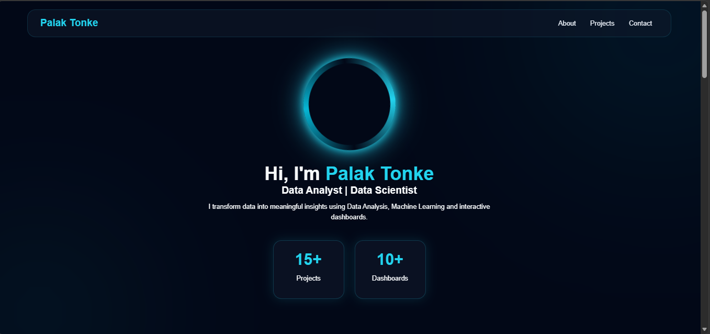

#  🚀 Personal Portfolio

Welcome to my personal portfolio website showcasing my work in **Data Science, Data Analytics, Machine Learning, and Business Intelligence**.

## 🌐 Live Demo

🔗 https://palak-porfolio-1jgp.vercel.app/

## 👨‍💻 About

I am **Palak Tonke**, a B.Tech Computer Science (Data Science) student passionate about building data-driven solutions. My interests include Data Analytics, Machine Learning, Data Visualization, and Business Intelligence.

## 🛠️ Skills

### Programming

* Python
* SQL

### Data Science

* Pandas
* NumPy
* Matplotlib
* Seaborn
* Exploratory Data Analysis (EDA)
* Feature Engineering

### Data Analytics

* Microsoft Excel
* Power BI
* KPI Reporting
* Data Visualization

### Tools

* Git
* GitHub
* VS Code
* Vercel

## ✨ Features

* Responsive Portfolio Website
* Project Showcase
* Skills Section
* Resume Download
* Contact Information
* Modern UI Design

## 🚀 Deployment

Deployed on **Vercel**

## 📬 Contact

📧 Email: palaktonke06@gmail.com

🐙 GitHub: https://github.com/palaktonke06-a11y

🌐 Portfolio: https://palak-porfolio-1jgp.vercel.app/

📂 GitHub Repository: https://github

